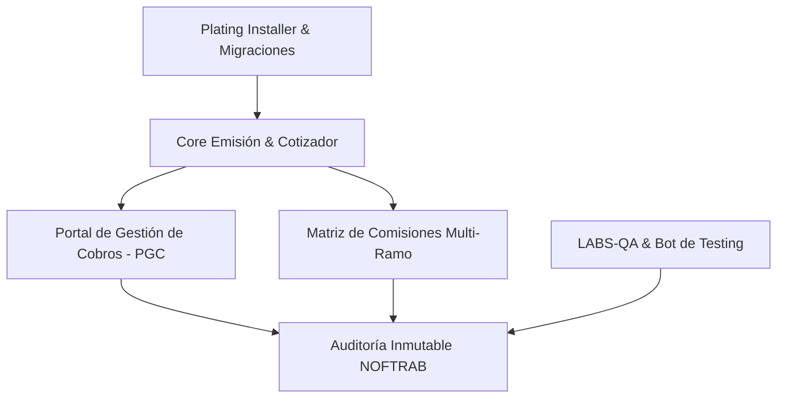

# 🏛️ MÁS QUE FIANZAS — Plataforma Integrada de Corretaje & Gestión Financiera B2B
[](#)
[](#)
[](#)
[](#)
[](#)

---

## 🎯 Propuesta de Valor B2B (Business-to-Business)

**MÁS QUE FIANZAS** es una solución tecnológica integral de nivel empresarial diseñada para digitalizar, optimizar y asegurar el ciclo de vida completo de corretaje de seguros y emisión de fianzas (warranties). La plataforma está construida específicamente para **aseguradoras, intermediarios de seguros, consorcios financieros y redes comerciales de reventa**.

### Beneficios Financieros y Operativos Clave
- **Reducción del Costo de Operación en un 40%**: Automatización total de la facturación prorrata y despachos de notificaciones de cobranza mediante bots autónomos.
- **Mitigación y Prevención de Fraude**: Implementación estricta del estándar de auditoría transaccional inmutable **NOFTRAB v4.0** que erradica la alteración de registros contables y la duplicidad de pólizas.
- **Ecosistema de Ventas Descentralizado**: Control administrativo y comercial unificado para múltiples Puntos de Venta (PDVs) y sub-corredores con liquidación de comisiones en tiempo real.
- **Inspección Documental con Inteligencia Artificial**: Integración nativa con servicios OCR para validación automática de identidades y expedientes, reduciendo el tiempo de onboarding de clientes de horas a segundos.

---

## 🗂️ Arquitectura del Ecosistema "PLATING-KIT"

La plataforma estructura su valor comercial y técnico a través del ecosistema modular **PLATING**, garantizando escalabilidad, auditoría forense y control sobre redes de ventas multinivel.



### 1. PLATING-CORE (Motor de Emisión & Cotización Dinámica)
* **Cotizador Multi-Ramo Inteligente**: Cotización en tiempo real para seguros de ley, seguros full de vehículos (Autobuses, Camiones, Jeeps, Sedanes) y emisión de fianzas/garantías financieras.
* **Diseñador de PDF de Alta Fidelidad**: Motor de renderizado vectorial de documentos con incrustación dinámica de firmas digitales, marcas de agua, logos institucionales en Base64 y códigos QR únicos para verificación de autenticidad en campo.

### 2. PLATING-PGC (Portal de Gestión de Cobros)
* **Cálculo de Prorrata Contable**: Algoritmo automatizado que calcula con precisión centesimal los montos adeudados y vigencias remanentes de las pólizas en caso de cancelaciones o reajustes temporales.
* **Módulo de Promesas de Pago**: Registro y monitoreo de compromisos financieros por cliente (Llamadas, Visitas, WhatsApp), clasificando automáticamente su cumplimiento para calificar el perfil crediticio del cliente.
* **CobroBot**: Motor inteligente de cobranzas que asocia el estado financiero de los contratos con alertas salientes para evitar la desprotección del asegurado.

### 3. PLATING-COMMISSIONS (Matriz de Comisión Multinivel)
* **Comisiones Granulares por Ramos**: Permite definir diferentes porcentajes de comisión para cada socio de la red comercial según el tipo de riesgo:
  - `comision_autos_ley` (Auto Responsabilidad Civil)
  - `comision_autos_full` (Seguro Contra Todo Riesgo)
  - `comision_fianzas` (Garantías Contractuales)
  - `comision_incendio` / `comision_rc` (Riesgos Generales)
* **Integración de Liquidación Bancaria**: Estructuración de datos bancarios (`banco`, `tipo_cuenta`, `numero_cuenta`) a nivel de perfil comercial para la automatización de pagos y transferencias masivas vía ACH.

### 4. PLATING-AUDIT (Estándar de Auditoría Forense NOFTRAB v4.0)
* **Trazabilidad Inmutable**: Cada acción realizada en la plataforma (anulación de pólizas, descuentos o ediciones de cobros) se registra automáticamente a nivel de base de datos de forma inalterable.
* **Doble Estado en JSON (Before/After)**: Almacenamiento instantáneo del registro completo antes y después del cambio en formato JSON estructurado, facilitando auditorías forenses instantáneas.
* **Justificación Escrita Obligatoria**: Bloqueo a nivel de backend que impide el almacenamiento de modificaciones si el operador no provee una justificación técnica detallada (mínimo 10 caracteres).

### 5. PLATING-INSTALLER (API de Despliegue Profesional)
* **Requisitos Automatizados (`plating_installer.php`)**: Diagnóstico interactivo que evalúa las capacidades del servidor WAMP/LAMP: versiones de PHP (>= 8.2), motores MySQL/MariaDB, extensiones requeridas (`mysqli`, `openssl`, `curl`, `gd`) y permisos de escritura en carpetas locales de uploads y logs.
* **Gestión de Migraciones**: Ejecutor de migraciones progresivas de base de datos (`migration_*.php`) con registro único de logs para actualizar la infraestructura del cliente sin riesgo de pérdida de datos.

### 6. LABS-QA (Portal de Soporte y Diagnóstico Avanzado)
* **BOT-TESTING-DEV**: Robot de pruebas automatizadas que simula flujos de venta, validación de sesiones y cálculos de comisiones, auto-corrigiendo desviaciones lógicas bajo estándares NOFTRAB.
* **Visualizador de Logs del Servidor**: Panel administrativo centralizado para supervisar en tiempo real los logs de errores PHP (`error.log`) y auditoría de envíos SMTP (`smtp.log`) de manera gráfica.

### 7. PLATING-CENTRO-TECNICO (Centro Técnico de Seguros & Control 4-VAF)
* **Solicitudes de Ajustes Excepcionales**: Gestión jerárquica de solicitudes de modificación para pólizas o cotizaciones emitidas (financieros: prima/aseguradora; vehículo: placa/marca/chasis; cliente: nombre/cédula; e intermediarios) con soporte adjunto obligatorio y justificación técnica VAF.
* **Simulación Contable Pre-Ejecución**: Calculador de impacto en tiempo real que pre-visualiza los asientos de débito/crédito (primas cobradas, comisiones por pagar, cuentas por cobrar aseguradoras) antes de aplicar cualquier cambio financiero.
* **Catálogo de Reglas de Negocio Configurable**: Gestor de parámetros operativos y contables con auditoría de versión y multiselección de módulos afectados.
* **Reglas de Documentos Procesados e Identificadores**: Control administrable de unicidad global para Cédulas (Luhn Mod 10), RNC (Mod 11 DGII), Pasaportes, Licencias de Conducir, Placas, Chasis/VIN y Números de Fianza/Póliza.

### 8. PLATING-CONFIG (Configuración Central & Validador de Documentos 4-VAF)
* **Validador de Documentos Dominicanos**: Interruptores master y por módulo (`VALIDADOR_DOCS_COTIZACIONES`, `VALIDADOR_DOCS_CLIENTES`, `VALIDADOR_DOCS_USUARIOS`, `VALIDADOR_DOCS_POLIZAS`, `VALIDADOR_DOCS_FIANZAS`) para control estricto de documentos de identidad.
* **Datos Corporativos & Logo Base64**: Parámetros de razón social, RNC institucional, teléfonos, correo oficial e incrustación de logotipo oficial MQF en formato Base64 para impresiones PDF de alta definición.
* **Motor SMTP & Plantillas HTML**: Notificaciones automáticas parametrizables con variables dinámicas (`{{NUMERO}}`, `{{CLIENTE}}`, `{{TOTAL_FMT}}`, `{{FECHA_LOCAL}}`).
* **Documentación Técnica Modular (`documentacion.php`)**: Centro unificado de manuales interactivos por módulo con exportación directa en formato PDF vectorial.

---

## 🛠️ Ficha Técnica & Integración Cloud

La plataforma combina un núcleo ultra-rápido en PHP con procesos analíticos asíncronos en Python e integraciones de clase mundial:

* **Backend Principal**: PHP 8.2 / 8.4 (compatible con arquitecturas WAMP en entornos Windows Server y LAMP en Linux Enterprise).
* **Motor Auxiliar de Datos**: Python 3.14.5 (soporta el motor ETL de importación masiva Banreservas y el sistema transaccional de permisos).
* **Google Cloud Vision API (OCR)**: Lectura automática de textos para validación de datos de matrículas y cédulas, almacenando las claves privadas mediante variables de entorno seguras (`google-key.json`).
* **Google Drive API & OneDrive (Cloud Sync)**: Respaldo atómico de la plataforma en la nube (`masque_fianzas_backup.zip` / `Backup_Plataforma_Integrada.zip`) vinculada mediante OAuth 2.0 y scripts de respaldos automatizados.
* **Motor Mailer SMTP**: Envío automatizado de cotizaciones y reportes de auditoría en formato HTML premium adaptativo (`Mailer.php`).

---

## 🚀 Despliegue en 3 Pasos (Instalación Rápida)

1. **Ubicación en Servidor Web**:
   Clonar o descomprimir el código dentro del directorio raíz de Apache (ej. `C:\wamp64\www\PLATAFORMA_INTEGRADA`).
2. **Preparación de Credenciales**:
   Copiar los archivos de plantilla `.example` provistos en el directorio `backend/config/` y completarlos con tus credenciales reales (SMTP, Google Drive, Google Cloud Vision).
3. **Instalador Plating**:
   Accede a la API de instalación a través de tu navegador o CLI para crear la base de datos y correr las migraciones del sistema de forma automática:
   ```
   POST http://localhost/PLATAFORMA_INTEGRADA/backend/api/plating_installer.php?action=crear_base_datos&setup_token=MasQF2026
   POST http://localhost/PLATAFORMA_INTEGRADA/backend/api/plating_installer.php?action=ejecutar_migracion&setup_token=MasQF2026
   ```

---

## 👥 Roles de Acceso Predeterminados (Malla RBAC)
- **Administrador (CEO/Gerente - Perfil 1)**: Acceso total a la configuración global, Centro Técnico, bandeja de aprobaciones de ajustes, auditorías inmutables NOFTRAB, importación ETL y portal LABS-QA.
- **Socio Comercial (Director/PDV)**: Gestión de clientes, cotizaciones y emisión de pólizas. Si tiene la restricción `solo_propios = 1` activa, sus listados se filtran automáticamente a nivel de base de datos para proteger la confidencialidad de su cartera comercial.
- **Vendedor (VEN)**: Cotización y registro de prospectos, con visualización limitada a sus propias comisiones generadas.

---

## 👨‍💻 Licenciamiento & Propiedad Intelectual
Desarrollado y optimizado bajo los estándares de ingeniería de software **NOFTRAB v4.0** y **PLATING-KIT**. Todos los derechos comerciales reservados para la comercialización e integraciones empresariales de seguros.
